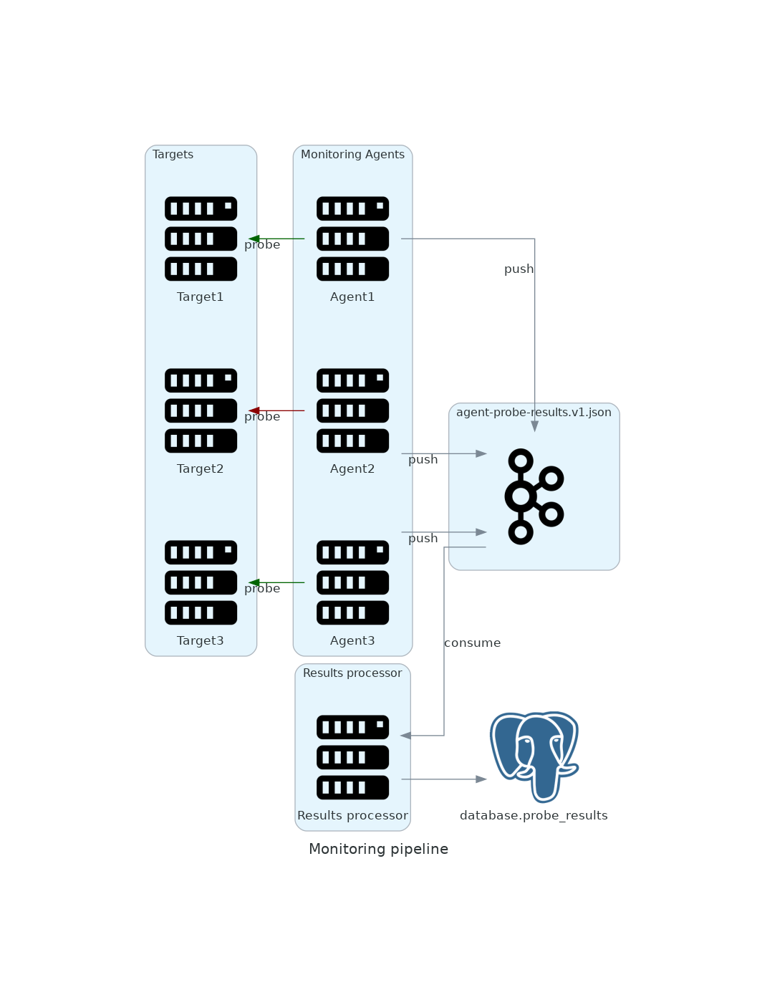

# go-metrics-collector

## Usage
### Agent
```
NAME:
   metrics-collector-agent - starts agent

USAGE:
   main [global options] command [command options] [arguments...]

COMMANDS:
   help, h  Shows a list of commands or help for one command

GLOBAL OPTIONS:
   --selector value, -s value      
   --brokers value, -b value       
   --targets value, -t value       (default: targets.yaml)
   --resultsTopic value, -r value  
   --certFile value                
   --keyFile value                 
   --caFile value                  
   --failureThreshold value        (default: 5)
   --help, -h                      show help (default: false)
```

### Results processor
```
NAME:
   metrics-collector-results-processor - starts results processor

USAGE:
   main [global options] command [command options] [arguments...]

COMMANDS:
   help, h  Shows a list of commands or help for one command

GLOBAL OPTIONS:
   --brokers value, -b value        
   --resultsTopic value, -r value   
   --certFile value                 
   --keyFile value                  
   --caFile value                   
   --databaseUri value, --db value  
   --help, -h                       show help (default: false)
```

## Components
### Overview
There are two types of components:
- agent
- results processor

### Agent
Agent performs probes to the given set of targets (see `targets.example.yaml`)

Each agent could select only subset of the targets from the targets file by using selectors.

Agent runs probes based on the configuration and pushes the results to the kafka topic.

### Results processor
Results processor is a kafka consumer which loads all messages from the topic and stores them to the Postgres database.

All running instances would be in the same consumer group.



## Local setup

### Settings
For the local setup and e2e tests all the settings are provided by `.env` file.
See `env.example` for reference.
Docker environment expects to have following files in the working directory:
- service.cert
- service.key
- ca.pem

### Targets

Agent takes `target.yaml` with the targets definition

```
- name: reddit_5_seconds # jobname to store 
  uri: https://reddit.com # target url
  interval: 5s # check interval
  regexp: ".*redux_json_start.*" # pattern to search for, if empty no search is performed
  selector: # selectors to match. If agent has no selectors set up it will ignore that section
    target: reddit
    enable: true
```

### Tests
- To run unit tests either use `go test ./...` locally or `docker-compose run unit_tests` to run them in containers
- To run e2e tests run `docker-compose run e2e_tests`. This will reset the database specified by the `.env` file!

### Running
- The command `docker-compose up agent resultsprocessor` spins up both agent and resultsprocessor locally.
 